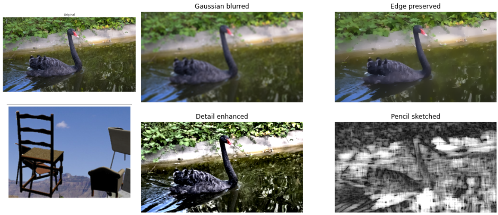
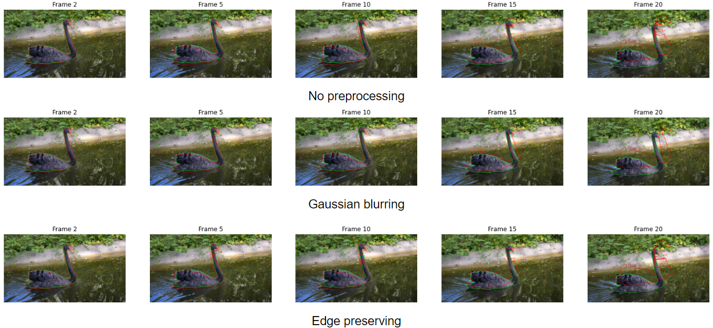
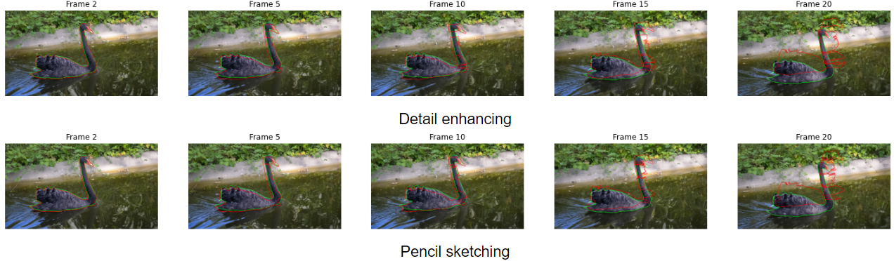
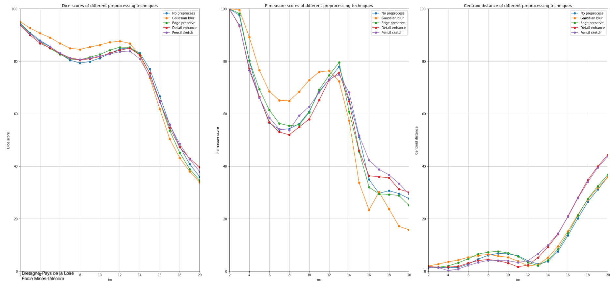
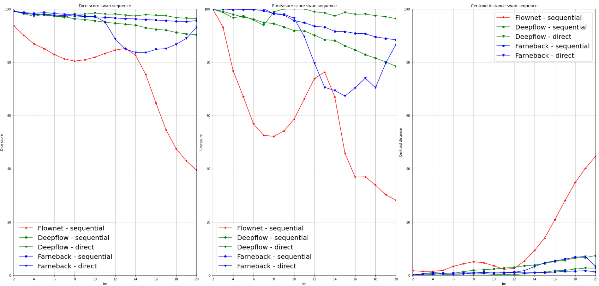
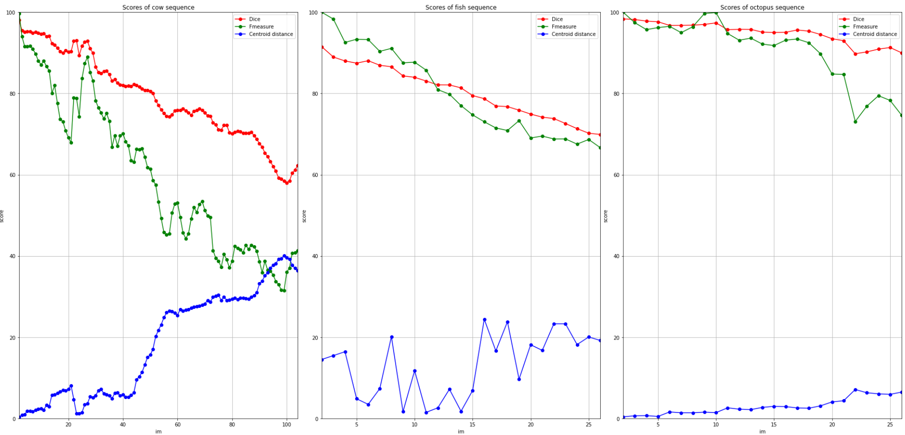

# Object-tracking-with-FlowNet

This project aims to employ optical flow based algorithms to perform object tracking task. The dataset consists of 9 sequences. Each sequence presents one moving object that is needed to be tracked, and its corresponded masks as the ground truth. 

The object is tracked by propagating the given mask of the **reference frame** to the current frame via *to-the-reference* optical flow estimation strategy. 
The flow between the current frame and the reference one can be computed via 2 integration methods: *direct* or *sequential*.

Then, the pipeline to track an object is composed of: 

1. Load the mask of the reference frame (usually the first frame in the sequence)
2. Computing the optical flow between
    - the current frame *t* and the reference frame (in direct integration), or 
    - the current frame *t* and the previous frame *t-1* then concatenate the computed flow to the previously integrated flow between frame *t-1* and reference frame (in sequential integration)
3. The mask of the current frame is the mask of the reference frame propagated to the current frame via the estimated flow between it and the reference frame.

For optical flow estimation, we benchmark 3 approaches: **FlowNet**, **Deepflow**, and **Farneback**. For all of them, the inputs are 2 consecutive frames and the output is a flow (for FlowNet the output is infered by the network then saved under numpy matrix format).

## 1. FlowNet

Flownet is a deep learning based approach presented in the paper: [FlowNet: Learning Optical Flow with Convolutional Networks](https://ieeexplore.ieee.org/document/7410673).

We adopt a pre-trained FlowNetS into our project for object tracking. The pre-trained weight can be download at: [weight](https://drive.google.com/drive/folders/16eo3p9dO_vmssxRoZCmWkTpNjKRzJzn5). This model is trained on FlyingChair dataset, which contains a huge number of synthesized images (64GB). 

In terms of implementation, we reuse the implementation of [@ClementPinard](https://github.com/ClementPinard/FlowNetPytorch).

### Input processing

Since we do not retrain again on our dataset, several pre-processing techniques, including Gaussian blurring, Detail enhancing, Edge preserving and Pencil sketching are employed to increase the accuracy of the tracking. The effect of each pre-processing on the input image is shown below:


### Results

The tracking results based on the optical flow estimated by FlowNetS on pre-processed as well as original inputs are demonstrated in the following figures:




The results are assessed by 3 metrics including **Dice score**, **F-measure score** and **Centroid distance**:


## 2. DeepFlow

Unlike FlowNet and similar to Farneback, DeepFlow is a learning-free optical flow estimation algorithm that aims to handle large displacement problem. It was presented in the paper: [DeepFlow](https://ieeexplore.ieee.org/document/6751282).

The main idea is to introduce another term called matching term beside two original terms in traditional optical flow estimation: data term and flow smoothing term.
The matching term benefits from the keypoint matching algorithm. Briefly, the traditional Horn-Schunk optical flow estimation relies on two main hypothese: brightness constancy and small motion.

## 3. Comparison between 3 optical flow approaches

The figure below shows the quantitative evaluations of 3 approaches using different integration methods. For FlowNet, the input is detail enhanced before being fed into the network.



## 4. Challenge

At the end of this project, a challenge between the different approaches (besides optical flow, for object tracking) as well as between different groups was held. Each group performed their best-performance techniques to track 3 different objects (cow, fish and octopus), each presents in 1 sequence. The length of the sequences is: 126 (cow), 26 (fish) and 26 (octopus).

At the end, our group with our optical flow approaches placed **3rd** in the challenge. The figure below shows our quantitative results for these 3 sequences, we use direct Deepflow for 2 sequences cow and octopus, and sequential Farneback for the fish.




### Citations
```
@INPROCEEDINGS{7410673,
          author={Dosovitskiy, Alexey and Fischer, Philipp and Ilg, Eddy and Häusser, Philip and Hazirbas, Caner and Golkov, Vladimir and Smagt, Patrick van der and Cremers, Daniel and Brox, Thomas},
          booktitle={2015 IEEE International Conference on Computer Vision (ICCV)}, 
          title={FlowNet: Learning Optical Flow with Convolutional Networks}, 
          year={2015},
          volume={},
          number={},
          pages={2758-2766},
          doi={10.1109/ICCV.2015.316}
}

@INPROCEEDINGS{6751282,
          author={Weinzaepfel, Philippe and Revaud, Jerome and Harchaoui, Zaid and Schmid, Cordelia},
          booktitle={2013 IEEE International Conference on Computer Vision}, 
          title={DeepFlow: Large Displacement Optical Flow with Deep Matching}, 
          year={2013},
          volume={},
          number={},
          pages={1385-1392},
          doi={10.1109/ICCV.2013.175}
}

@InProceedings{10.1007/3-540-45103-X_50,
        author="Farneb{\"a}ck, Gunnar",
        editor="Bigun, Josef
        and Gustavsson, Tomas",
        title="Two-Frame Motion Estimation Based on Polynomial Expansion",
        booktitle="Image Analysis",
        year="2003",
        publisher="Springer Berlin Heidelberg",
        address="Berlin, Heidelberg",
        pages="363--370",
        abstract="This paper presents a novel two-frame motion estimation algorithm. The first step is to approximate each neighborhood of both frames by quadratic polynomials, which can be done efficiently using the polynomial expansion transform. From observing how an exact polynomial transforms under translation a method to estimate displacement fields from the polynomial expansion coefficients is derived and after a series of refinements leads to a robust algorithm. Evaluation on the Yosemite sequence shows good results.",
        isbn="978-3-540-45103-7"
}
```
